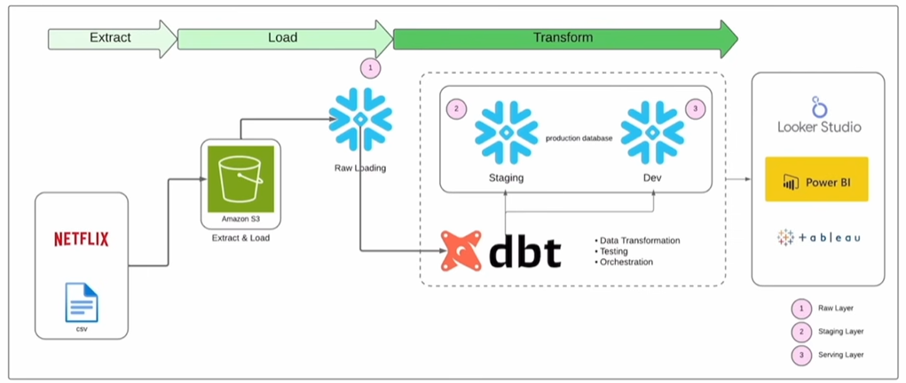
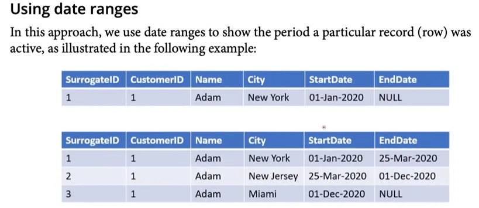

# Netflix Analysis using DBT & Snowflake

**What is DBT:**

DBT (Data Build Tool) is a transformation framework used in modern data engineering.
It focuses on the T in ETL/ELT, meaning it helps transform raw data into clean, usable models inside the data warehouse.

Before DBT, data teams relied on:

1. SQL Scripts
    - Manually created and stored
    - No version control
    - Hard to reuse and maintain
2. Traditional ELT Tools
    - Expensive and complex
    - Required specialized tool knowledge
3. Custom Code (Python, Scala, etc.)
    - Hard to standardize
    - Increased technical debt

These approaches caused several issues:

- Low maintainability
- Lack of proper testing
- Poor or missing documentation
- Dependency problems
- Limited collaboration between teams

**Why DBT?**

1. Reusability: Write once and reuse SQL logic across multiple models using shared code and macros.
2. Document Generation: Automatically generates clean documentation and lineage for all models and sources.
3. Dependency Management: Uses ref() to manage model dependencies and ensure correct execution order.
4. Development Workflow: Provides a smooth workflow with version control, testing, environments, and easy debugging.



**DBT Processes:**

Loading → Transform → Snapshot → Test → Deploy → Document


**Data Engineering Life Cycle:** 


**DBT with Data Warehouse:**


**Data Warehouse**:

A data warehouse is a central repository designed for storing and analyzing large volumes of structured data from various sources

**Data Lake:** 

A data lake is a storage repository that holds a vast amount of raw data in its native until its needed

**Data Lakehouse:**

A data lakehouse is a modern architecture that combines the scalability of data lakes with the structured management and performance of data warehouses.

**ETL vs ELT:**

ETL (Extract, Transform, Load): 

Data is transformed before loading into the warehouse. Suitable for structured, smaller datasets.

ELT (Extract, Load, Transform): 

Data is loaded first, then transformed inside the warehouse. Ideal for large, raw datasets and modern cloud architectures like Snowflake.

**Modern Data Architecture:**


**Lets Start with Project….**

Data Profile: 

MovieLens 20M dataset

ratings.csv - `userId,movieId,rating,timestamp` 

tags.csv - `userId,movieId,tag,timestamp`

movies.csv - `movieId,title,genres`

links.csv - `movieId,imdbId,tmdbId`

genome-scores.csv - `movieId,tagId,relevance`

genome-tags.csv - `tagId,tag`

## **Part 1. Project Setup:**

```sql
-- Step 1: Use an admin role
USE ROLE ACCOUNTADMIN;

-- Step 2: Create the `transform` role and assign it to ACCOUNTADMIN
CREATE ROLE IF NOT EXISTS TRANSFORM;
GRANT ROLE TRANSFORM TO ROLE ACCOUNTADMIN;

-- Step 3: Create a default warehouse
CREATE WAREHOUSE IF NOT EXISTS COMPUTE_WH;
GRANT OPERATE ON WAREHOUSE COMPUTE_WH TO ROLE TRANSFORM;

-- Step 4: Create the `dbt` user and assign to the transform role
CREATE USER IF NOT EXISTS dbt
  PASSWORD=###
  LOGIN_NAME=###
  MUST_CHANGE_PASSWORD=FALSE
  DEFAULT_WAREHOUSE='COMPUTE_WH'
  DEFAULT_ROLE=TRANSFORM
  DEFAULT_NAMESPACE='MOVIELENS.RAW'
  COMMENT='DBT user used for data transformation';
ALTER USER dbt SET TYPE = LEGACY_SERVICE;
GRANT ROLE TRANSFORM TO USER dbt;

-- Step 5: Create a database and schema for the MovieLens project
CREATE DATABASE IF NOT EXISTS MOVIELENS;
CREATE SCHEMA IF NOT EXISTS RAW;

-- Step 6: Grant permissions to the `transform` role
GRANT ALL ON WAREHOUSE COMPUTE_WH TO ROLE TRANSFORM;
GRANT ALL ON DATABASE MOVIELENS TO ROLE TRANSFORM;
GRANT ALL ON ALL SCHEMAS IN DATABASE MOVIELENS TO ROLE TRANSFORM;
GRANT ALL ON FUTURE SCHEMAS IN DATABASE MOVIELENS TO ROLE TRANSFORM;
GRANT ALL ON ALL TABLES IN SCHEMA MOVIELENS.RAW TO ROLE TRANSFORM;
GRANT ALL ON FUTURE TABLES IN SCHEMA MOVIELENS.RAW TO ROLE TRANSFORM;

CREATE STAGE netflixstage;

-- Set defaults
USE WAREHOUSE COMPUTE_WH;
USE DATABASE MOVIELENS;
USE SCHEMA RAW;

```

Create Stage and Tables & Load Data: 

```sql
-- LOAD RAW MOVIES
CREATE OR REPLACE TABLE raw_movies (
    movieId INTEGER,
    title STRING,
    genres STRING    
);

COPY INTO raw_movies
FROM '@netflixstage/movies.csv'
FILE_FORMAT = (TYPE = 'CSV' SKIP_HEADER = 1 FIELD_OPTIONALLY_ENCLOSED_BY = '"' );

SELECT * FROM RAW_MOVIES;

-- LOAD RAW RATINGS
CREATE OR REPLACE TABLE raw_ratings (
  userId INTEGER,
  movieId INTEGER,
  rating FLOAT,
  timestamp BIGINT
);

COPY INTO raw_ratings
FROM '@netflixstage/ratings3.csv'
FILE_FORMAT = (TYPE = 'CSV' SKIP_HEADER = 1 FIELD_OPTIONALLY_ENCLOSED_BY = '"');

SELECT * FROM RAW_RATINGS;

-- LOAD RAW TAGS
CREATE OR REPLACE TABLE raw_tags (
  userId INTEGER,
  movieId INTEGER,
  tag STRING,
  timestamp BIGINT
);

COPY INTO raw_tags
FROM '@netflixstage/tags.csv'
FILE_FORMAT = (TYPE = 'CSV' SKIP_HEADER = 1 FIELD_OPTIONALLY_ENCLOSED_BY = '"')
ON_ERROR = 'CONTINUE';

-- Load RAW GENOME SCORES
CREATE OR REPLACE TABLE raw_genome_scores (
  movieId INTEGER,
  tagId INTEGER,
  relevance FLOAT
);

COPY INTO raw_genome_scores
FROM '@netflixstage/genome-scores2.csv'
FILE_FORMAT = (TYPE = 'CSV' SKIP_HEADER = 1 FIELD_OPTIONALLY_ENCLOSED_BY = '"');

-- LOAD RAW GENOME TAGS
CREATE OR REPLACE TABLE raw_genome_tags (
  tagId INTEGER,
  tag STRING
);

COPY INTO raw_genome_tags
FROM '@netflixstage/genome-tags.csv'
FILE_FORMAT = (TYPE = 'CSV' SKIP_HEADER = 1 FIELD_OPTIONALLY_ENCLOSED_BY = '"');

-- Load RAW LINKS
CREATE OR REPLACE TABLE raw_links (
  movieId INTEGER,
  imdbId INTEGER,
  tmdbId INTEGER
);

COPY INTO raw_links
FROM '@netflixstage/links.csv'
FILE_FORMAT = (TYPE = 'CSV' SKIP_HEADER = 1 FIELD_OPTIONALLY_ENCLOSED_BY = '"');
```

---

## **Part 2: Getting Started with DBT**

```python
# Create Virtual Environment
python -m venv venv
venv/Scripts/active

#Install dbt
pip install dbt-snowflake

#Create dbt profile
mkdir %userprofile%\.dbt

#Create project
dbt init netflix 
#Enter the snowflake credentials and continue
```

Update profiles.yml as

```yaml
netflix:
  outputs:
    dev:
      account: ##
      database: MOVIELENS
      password: ##
      role: TRANSFORM
      schema: DEV
      threads: 1
      type: snowflake
      user: dbt
      warehouse: COMPUTE_WH
  target: dev
```

### **DBT Models:**

DBT models are SQL `SELECT` statements that define how raw data is transformed into structured, usable formats. They represent the transformations applied to the data in a DBT project.

Each Model:

- is defined as a `.sql` file.
- Contains a single `SELECT` statement that defines the transformation logic.
- Produces a table or view in the data warehouse.
- Can reference other models, creating a dependency graph

Models are the core building blocks of DBT project and represents the transformations applied to data

### **DBT Materializations**

Materializations in DBT define how a model’s SQL query results are stored or used in the data warehouse. They determine whether the output is a table, view, incremental table, or temporary result.

Common Types of Materializations:

1. Table:
    - Creates a full table in the warehouse.
    - Rebuilt completely each time the model runs.
2. View:
    - Creates a view instead of a table.
    - Always reflects the latest data without storing a separate table.
3. Incremental:
    - Only new or changed data is processed and added.
    - Efficient for large datasets as it avoids rebuilding the full table.
4. Ephemeral:
    - Does not create a table or view in the warehouse.
    - The SQL is inlined in downstream models.
    - Useful for intermediate calculations that are only needed temporarily.

Materializations help control performance, storage, and refresh strategies for your DBT models.

1. **Create Stage Models**
    
     models/staging/src_movies.sql
    
    ```sql
    WITH raw_movies AS (
            SELECT * FROM MOVIELENS.RAW.RAW_MOVIES
    )
    SELECT 
        movieId AS movie_id,
        title,
        genres
    FROM raw_movies
    ```
    
    models/staging/src_rarings.sql
    
    ```sql
    {{ config(materialized = 'table') }}
    
    With raw_ratings as (
        select * from MOVIELENS.RAW.RAW_RATINGS
    )
    Select 
        userId as user_id,
        movieId as movie_id,
        rating, 
        to_timestamp_ltz(timestamp) as rating_timestamp
    From raw_ratings
    ```
    
    models/staging/src_tags.sql
    
    ```sql
    {{ config(materialized = 'table') }}
    WITH raw_tags AS (
        SELECT * FROM movielens.raw.raw_tags
    )
    SELECT 
        userId AS user_id,
        movieId AS movie_id,
        tag,
        TO_TIMESTAMP_LTZ(TIMESTAMP) AS tag_timestamp
    from raw_tags
    ```
    
    models/staging/src_genome_score.sql
    
    ```sql
    WITH raw_genome_scores AS (
        SELECT * FROM MOVIELENS.RAW.RAW_GENOME_SCORES
    )
    SELECT 
        movieId AS movie_id,
        tagId AS tag_id,
        relevance
    FROM raw_genome_scores
    ```
    
    models/staging/src_genome_tags.sql
    
    ```sql
    WITH raw_genome_tags AS (
        SELECT * FROM movielens.raw.raw_genome_tags
    )
    SELECT 
        tagId AS tag_id,
        tag
    FROM raw_genome_tags
    ```
    
    models/staging/src_links.sql
    
    ```sql
    with raw_links as (
        select * from movielens.raw.raw_links
    )
    select 
        movieId as movie_id,
        imdbId as imdb_id,
        tmdbId as tmdb_id
    from raw_links
    ```
    

Then run `dbt run`

update dbt_project.yml as

```yaml
models:
  netflix:
      +materialized: view
      dim:
        +materialized: table
      fct:
        +materialized: table
```

so that by default the models in dim, fct folder will be created as table

1. **Creating Dim Models**
    
    models/dim/dim_movies.sql
    
    ```sql
    WITH src_movies AS (
        SELECT * FROM {{ ref('src_movies')}}
    )
    SELECT 
        movie_id,
        INITCAP(TRIM(title)) as movie_title,
        SPLIT(genres, '|') as genre_array,
        genres
    FROM src_movies
    ```
    
    models/dim/users.sql
    
    ```sql
    WITH ratings AS (
        SELECT DISTINCT user_id FROM {{ ref('src_ratings') }}
    ), 
    tags AS (
        SELECT DISTINCT user_id FROM {{ ref('src_tags') }}
    )
    SELECT DISTINCT user_id 
    FROM (
        SELECT * FROM ratings 
        UNION
        SELECT * FROM tags
    )
    ```
    
    models/dim/dim_genome_tags.sql
    
    ```sql
    WITH src_tag AS (
        SELECT * FROM {{ ref('src_genome_tags') }}
    )
    SELECT
        tag_id,
        INITCAP(TRIM(tag)) as tag_name
    FROM src_tag
    ```
    
    models/dim/movies_with_tags.sql
    
    ```sql
    {{ config(materialized = 'ephemeral') }}
    WITH movies AS (
        SELECT * FROM {{ ref('dim_movies')}}
    ),
    tags AS (
        SELECT * FROM {{ ref('dim_genome_tags')}}
    ),
    scores AS (
        SELECT * from {{ ref('fct_genome_scores')}}
    )
    
    SELECT 
        m.movie_id, 
        m.movie_title,
        m.genres,
        t.tag_name,
        s.relevence_score    
    FROM movies m
    LEFT JOIN scores s on m.movie_id = s.movie_id
    LEFT JOIN tags t on t.tag_id = s.tag_id
    ```
    
    An **ephemeral model** is a *temporary transformation* that does not create a table or view in the data warehouse.
    
    Instead, DBT inlines (embeds) the SQL logic of the ephemeral model directly into downstream models that reference it.
    
    Why use Ephemeral models?
    
    - For intermediate calculations
    - To avoid creating unnecessary tables/views
    - To keep the warehouse clean
    - To improve performance for small transformations
    
2. **Create fact models**

models/fct/fct_genome_score.sql

```sql
WITH src_scores AS (
    SELECT * FROM {{ ref('src_genome_scores') }}
)

SELECT
    movie_id,
    tag_id,
    ROUND(relevance, 4) AS relevance_score
FROM src_scores
WHERE relevance > 0
```

models/fct/fct_ratings.sql

```sql
{{ 
    config(
        materialized = 'incremental',
        on_schema_change = 'fail'
    ) 
}}

WITH src_ratings AS (
    SELECT * FROM {{ ref('src_ratings') }}
)

SELECT 
    user_id, 
    movie_id,
    rating,
    rating_timestamp
FROM src_ratings
WHERE rating IS NOT NULL 


    AND rating_timestamp > (
        SELECT MAX(rating_timestamp)
        FROM {{ this }}
    )

```

`materialized = 'incremental'`

Tells DBT to build this model as an **incremental table**

→ First run: DBT creates the full table

→ Next runs: only new data is added

Finds the latest rating_timestamp already present in the table.

Loads only rows greater than that timestamp

---

## Part 3: Seeds & Sources

### **DBT Seeds**

**What are Seeds?**

Seeds are **CSV files** that you place inside your DBT project (in the `data/` folder).

DBT loads these CSV files **into the warehouse as tables**.

They act like *small reference datasets*—similar to lookup tables.

**Why use Seeds?**

- Easy to manage small static datasets
- Version-controlled (because they live in the repo)
- Automatically loaded using `dbt seed`
- Useful for lookups, tags, mapping tables, metadata

seed/seed_movie_release_dates.csv

```sql
movie_id,release_date
1,1995-10-20
2,1995-10-21
3,1995-10-25
4,1995-10-30
5,1995-11-03
6,1995-11-10
7,1995-11-15
8,1995-11-17
9,1995-11-22
10,1995-11-24
```

run `dbt seed`

models/mart/mart_movie_releases.sql

```sql
{{ 
    config(
        materialized = 'table'
    ) 
}}
WITH fct_ratings AS (
    SELECT * FROM {{ ref('fct_ratings') }}
),
seed_dates AS (
    SELECT * FROM {{ ref('seed_movie_release_dates') }}
)
SELECT
    f.*,
    CASE 
        WHEN d.release_date IS NULL THEN 'unknown'
        ELSE 'known' 
    END release_info_available
FROM fct_ratings f
LEFT JOIN seed_dates d
ON f.movie_id = d.movie_id
```

Now the mart table is created


### **DBT Sources**

**What are Sources?**

Sources in DBT represent **raw data** that comes directly from external systems or pipelines (e.g., Snowflake tables, CSV ingestion tables, data from APIs, logs).

They're defined in YAML files and tell DBT:

- *Where the raw data lives*
- *What schema/table it belongs to*
- *That the data should be treated as an official input dataset*

**Why use Sources?**

- Organizes raw data
- Enables tests (freshness, uniqueness, null checks)
- Provides data lineage (source → staging → marts)
- Improves documentation

---

**sources.yml**

```yaml
version: 2 
sources:
  - name: netflix
    schema: raw
    tables:
     - name: r_movies
       identifier: raw_movies
     - name: r_ratings
       identifier: raw_ratings
     - name: r_tags
       identifier: raw_tags
     - name: r_genome_tags
       identifier: raw_genome_tags
     - name: r_genome_scores
       identifier: raw_genome_scores
     - name: r_links
       identifier: raw_links
```

Usage inside a model:

```sql
SELECT * FROM {{ source('raw_data', 'raw_movies') }}
```

**Meaning:**

“Use the table `public.raw_movies` as the raw input for this model.”

---

## Part 4: SCD and Snapshot

### **Slowly Changing Dimensions (SCD)**

Slowly Changing Dimensions are a data warehousing concept used to manage and track changes in dimensional data over time.
These are attributes that change slowly and not on a regular schedule, such as a customer’s address, phone number, or job title.

SCD techniques help decide how to store historical changes in dimension tables.

Types of SCD

**SCD Type 0 — Passive / Fixed**

- No changes are tracked.
- The original value is preserved.

Use case: Values that should never change (e.g., Date of Birth).

**SCD Type 1 — Overwrite**


- New data overwrites the old value.
- No history is maintained.

Use case: Corrections or non-critical historical attributes.

**SCD Type 2 — Historical Versioning**




Each change creates a new record in the dimension table.

History is preserved using:

- Start date / end date
- Current flag
- Version number

Use case: When tracking historical changes is important (e.g., customer address history).

**SCD Type 3 — Limited History**


Only two states stored:

- Current value
- Previous value

Tracks limited history with additional columns (e.g., current_city, previous_city).
Use case: When only recent history is needed.

**SCD Type 4 — History Table**

The main dimension table keeps only the current values.

All historical records are stored in a separate history table.
Use case: When the main table must stay small and optimized.

**SCD Type 6 — Hybrid (Type 1 + Type 2 + Type 3)**


Combines features of Type 1, Type 2, and Type 3.

Keeps full history (Type 2), overwrites selected attributes (Type 1), and stores previous values (Type 3).
Use case: Complex tracking requirements.

Lets see how SCD are implemented in DBT…

### DBT Snapshots

**What is a Snapshot?**

Snapshots capture **how data changes over time** by recording historical versions of your data. They implement **Slowly Changing Dimensions (SCD Type 2)**.

**Why Use Snapshots?**

- Track historical changes in data
- Audit data modifications
- Time-travel queries (view data as it was at any point)
- Compliance and regulatory requirements

**How Snapshots Work**

1. **First Run**: Takes a full copy of source data with timestamps
2. **Subsequent Runs**:
    - Compares current data with last snapshot
    - Detects changes (new, updated, deleted records)
    - Adds new rows for changed records
    - Updates `valid_to` timestamp on old versions

**Snapshot Columns**

DBT automatically adds tracking columns:

- `dbt_valid_from`: When this version became active
- `dbt_valid_to`: When this version was replaced (NULL = current)
- `dbt_updated_at`: Timestamp of last check
- `dbt_scd_id`: Unique identifier for each version

snapshots/snap_tags.sql

```sql


{{
    config(
        target_schema='snapshots',
        strategy='timestamp',
        unique_key='row_key',
        updated_at='tag_timestamp',
        invalidate_hard_deletes=True
    )
}}

SELECT
    {{ dbt_utils.generate_surrogate_key(['user_id','movie_id','tag']) }} AS row_key,
    user_id,
    movie_id,
    tag,
    CAST(tag_timestamp AS TIMESTAMP_NTZ) AS tag_timestamp
FROM {{ ref('src_tags') }}
LIMIT 100


```

run `dbt run --select src_tags`

run `dbt snapshot`

```sql
UPDATE src_tags
SET tag = 'Mark Waters Returns', tag_timestamp = CAST(CURRENT_TIMESTAMP() AS TIMESTAMP_NTZ)
WHERE user_id = 18;
```

run `dbt snapshot`


As we can see active and inactive rows

## Part 5: Testing

**What is Testing in dbt?**

**dbt tests** are checks you write to ensure that your data in tables/models is correct, clean, and trustworthy.

Think of dbt testing as **Data Quality + Business Rule validation** built directly into your SQL transformations.

dbt runs these tests automatically and shows you where data is breaking.

---

**Why Testing in dbt Matters**

dbt tests help you catch:

- NULL values in critical columns
- Duplicate values
- Wrong data types
- Invalid relationships between tables
- Business rule violations

It ensures your pipelines don’t push **bad data** downstream.

---

**Types of Tests in dbt**

 1. **Generic Tests (built-in tests)**

These are common data quality checks available out of the box.

| Test | Meaning |
| --- | --- |
| **unique** | Column must have no duplicates |
| **not_null** | Column cannot be NULL |
| **accepted_values** | Column must match allowed values |
| **relationships** | Ensures foreign key relationship |

model/staging/schema.yml

```yaml
models:
  - name: dim_movies
    description: Dimension table for cleansed movie metadata
    columns:
      - name: movie_id
        description: Primary key of the movie
        tests:
          # - unique
          - not_null
      - name: movie_title
        description: Standardized movie title
        tests:
          - not_null
      - name: genre_array
        description: List of genres in array format
      - name: genres
        description: Raw genre string from source

  - name: dim_users
    description: Dimension table of unique users from both ratings and tags
    columns:
      - name: user_id
        description: Unique user identifier
        tests:
          # - unique
          - not_null

  - name: dim_genome_tags
    description: Dimension table of genome tag labels
    columns:
      - name: tag_id
        description: Unique tag ID
        tests:
          - not_null
          # - unique
      - name: tag_name
        description: Cleaned, human-readable tag name
        tests:
          - not_null

  - name: fct_ratings
    description: Fact table of user ratings for movies
    columns:
      - name: user_id
        description: Foreign key to dim_users
        tests:
          - not_null
      - name: movie_id
        description: Foreign key to dim_movies
        tests:
          - not_null
          - relationships:
              to: ref('dim_movies')
              field: movie_id
      - name: rating
        description: User's rating for a movie
        tests:
          - not_null
      - name: rating_timestamp
        description: Unix timestamp when the rating was made

  - name: fct_genome_scores
    description: Fact table of relevance scores per movie and tag
    columns:
      - name: movie_id
        description: Foreign key to dim_movies
        tests:
          - not_null
      - name: tag_id
        description: Foreign key to dim_genome_tags
        tests:
          - not_null
      - name: relevance_score
        description: Relevance score (0 to 1) for tag's association with movie
        tests:
          - not_null
```

Run:  `dbt test`

---

2. **Singular (Custom) Tests**

Singular tests are custom SQL queries that returns rows that fail the test. An empty resunt set means the tests are passed

tests/relevence_score.sql

```sql
SELECT movie_id, tag_id, relevance_score
FROM {{ ref('fct_genome_scores') }}
WHERE relevance_score <= 0
```

Run: `dbt test`

If this query returns rows → test fails.

**Where Do dbt Tests Run?**

dbt runs tests **directly in data warehouse** (Snowflake, BigQuery, Redshift, etc.)

That means:

- No local computation
- Tests run at scale
- Results are stored in your warehouse

**How dbt Test Workflow Works**

1. You define tests in YAML or SQL
2. Run: `dbt test`
3. dbt generates SQL for each test
4. dbt executes it in your warehouse
5. If any rows violate the rule → test fails
6. You get a clean report of passed/failed tests

## Part 6: Macro

**What is a Macro in dbt?**

A **macro** in dbt is a reusable piece of SQL or Jinja code that helps you avoid repetition.

It works like a **function**: you write it once, and use it anywhere in your models.

---

**Why Macros Are Useful**

- Reduce duplicate SQL
- Make transformations cleaner
- Allow dynamic SQL (loops, conditions, parameters)
- Centralize logic in one place

---

macros/no_nulls_in_columns.sql

```sql

    SELECT * FROM {{ model }} WHERE
    
        {{ col.column }} IS NULL OR
    
    FALSE

```

This replaces repetitive SQL with a single function call.

tests/relevence_score.sql

```sql
SELECT movie_id, tag_id, relevance_score
FROM {{ ref('fct_genome_scores') }}
WHERE relevance_score <= 0
```

Run: `dbt test`

## Part 7: Docs, Packages

### dbt Docs

**dbt Docs** is an auto-generated interactive documentation site for your dbt project.

It shows your models, sources, tests, lineage, descriptions, and dependencies — all in one visual place.

Think of it as a **data catalog + lineage viewer** automatically created from your dbt project.

It provides:

- A visual **lineage graph**
- Model and column **descriptions**
- **Source** and **test** details
- Searchable project metadata

Run:

`dbt docs generate`

`dbt docs serve`

dbt Docs helps you understand your entire data pipeline in one visual, interactive place.

### Packages

**dbt packages** are reusable bundles of dbt code (models, macros, tests, utilities) that you can install into your dbt project — similar to Python packages or npm libraries.

They let you use pre-built logic instead of writing everything from scratch.

---

**Why dbt Packages Are Useful**

- Save time by using proven, community-built solutions
- Avoid rewriting common logic (tests, macros, utilities)
- Standardize transformations
- Add advanced features easily

---

**How to Use a Package**

1. Add the package to your `packages.yml`:

```yaml
packages:
  - package: dbt-labs/dbt_utils
    version: ">=1.1.0"
```

1. Install packages: `dbt deps`

---

**Common dbt Packages**

- **dbt_utils** → advanced tests, macros
- **dbt_expectations** → data quality tests
- **codegen** → auto-generate models & schema files
- **dbt_date** → date utilities

## Part 8: Jinja Templating

## Part 9: Hooks

## Part 10: Incremental Models (strategies: append, merge, delete+insert)

## Part 11: Custom Materialization, Schema, Alias

## Part 12: Analyses

## Part 13: Exposure, Metrics

## Part 14: CI/CD Integration

## Part 15: Performance Optimization

## Part 16: Data Contracts

## Part 17: Unit Tests, Freshness Tests

## Part 18: Python Models

## Part 19: dbt Mesh (multi-project setup)

## Part 20: Adapter Development